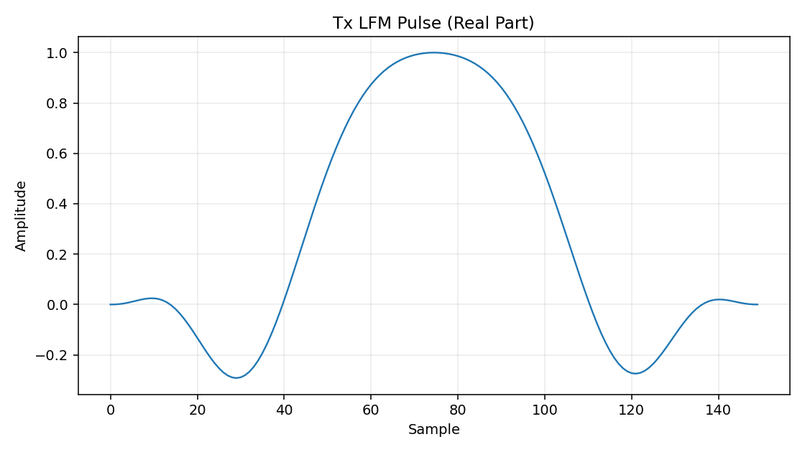
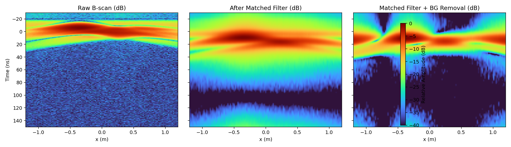
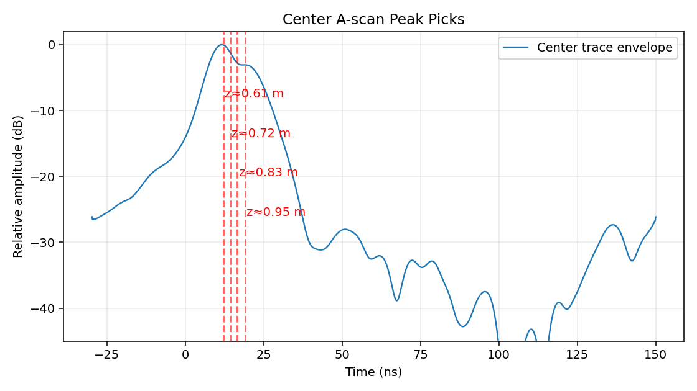

# 《现代信号处理》课程设计报告（GPR方向）

## 基本信息
- 课程名称：现代信号处理
- 题目：基于LFM脉冲压缩与背景去除的单通道GPR埋设目标检测仿真
- 学号：`[请填写]`
- 姓名：`[请填写]`
- 专业：`[请填写]`
- 指导教师：`[请填写]`
- 日期：`[请填写]`

---

## 1. 问题描述
地质雷达（GPR）在浅层地下目标探测中应用广泛，但回波信号常受到以下因素影响：
1. 目标回波幅度较弱；
2. 地表直达波与背景杂波较强；
3. 噪声导致目标峰值不明显。

因此，本课程设计目标是：在可控仿真环境下，构建包含目标回波、直达波、杂波和噪声的单通道GPR B-scan数据，并利用现代信号处理方法实现目标增强与深度估计。

---

## 2. 方法

### 2.1 发射信号建模
采用基带线性调频（LFM）信号：
\[
s(t)=w(t)\exp\{j\pi\mu(t-T/2)^2\},\quad 0\le t\le T
\]
其中：
- \(T\)：脉冲宽度；
- \(\mu=B/T\)：调频率；
- \(w(t)\)：汉宁窗，用于降低旁瓣。

### 2.2 回波场景构建
- 两个地下点目标，横向位置与埋深分别设为 \((x_1,z_1)\), \((x_2,z_2)\)；
- 传播速度 \(v=c/\sqrt{\varepsilon_r}\)；
- 双程时延：
\[
\tau(x)=\frac{2\sqrt{(x-x_0)^2+z^2}}{v}
\]
- 叠加地表直达波、缓变背景杂波及复高斯噪声，形成原始B-scan。

### 2.3 信号处理流程
1. **匹配滤波（脉冲压缩）**：
   \[
   y(t)=r(t)*s^*(-t)
   \]
   用于提高目标可分辨性与信噪比。
2. **背景去除**：按时间采样点减去横向均值，抑制静态杂波。
3. **包络检测**：FFT-Hilbert方法提取包络幅度。
4. **峰值检测**：在中心A-scan上进行峰值提取并换算埋深。

---

## 3. 仿真设置

### 3.1 主要参数
- 相对介电常数：\(\varepsilon_r=9\)
- 中心频率：500 MHz
- 带宽：300 MHz
- 脉冲时长：30 ns
- 采样率：5 GHz
- 时间窗：180 ns
- B-scan道数：121
- 横向范围：[-1.2 m, 1.2 m]
- 噪声标准差：0.06

### 3.2 目标参数
- 目标1：\(x=-0.35\,m,\ z=0.48\,m\)
- 目标2：\(x=0.55\,m,\ z=0.72\,m\)

---

## 4. 仿真结果

> 运行脚本后将自动生成图片与 `summary.json`，以下插图路径可直接在 Markdown 预览中显示。

### 4.1 发射LFM脉冲


### 4.2 B-scan处理前后对比


观察：
- 原始图中直达波与背景成分明显；
- 匹配滤波后双曲线回波结构增强；
- 背景去除后静态杂波被压制，目标轨迹更清晰。

### 4.3 中心A-scan峰值检测


通过中心道峰值提取得到若干回波峰，按传播速度换算得到埋深估计值（详见 `results/summary.json`）。

---

## 5. 结论
1. 匹配滤波能有效压缩LFM脉冲，提高目标回波可检测性；
2. 背景去除对抑制静态杂波有效，与匹配滤波结合可显著改善B-scan可视化效果；
3. 在当前参数下，中心A-scan峰值检测可得到与目标埋深量级一致的估计结果；
4. 本设计流程简单、可复现，适合作为现代信号处理课程中的GPR方向实验案例。

---

## 6. 可复现实验步骤
```bash
cd /mnt/e/Openclaw/.openclaw/workspace/shared/course_signal_design
python3 simulate_gpr_course_design.py
```

输出文件：
- `results/01_tx_pulse.png`
- `results/02_bscan_compare.png`
- `results/03_center_trace_peaks.png`
- `results/summary.json`

---

## 7. 生成 PDF 步骤
可选任一方式：

### 方式A：Pandoc（推荐）
```bash
cd /mnt/e/Openclaw/.openclaw/workspace/shared/course_signal_design
pandoc report_course_design.md -o report_course_design.pdf --pdf-engine=xelatex
```

### 方式B：Typora / VSCode 导出
1. 打开 `report_course_design.md`；
2. 确认图片路径 `results/*.png` 正常显示；
3. 选择“导出为 PDF”。

---

## 8. 附录：代码与文件清单
- `simulate_gpr_course_design.py`：主仿真代码
- `README_topic_and_plan.md`：题目与方案说明
- `report_course_design.md`：课程设计报告
- `results/`：图像与JSON结果
